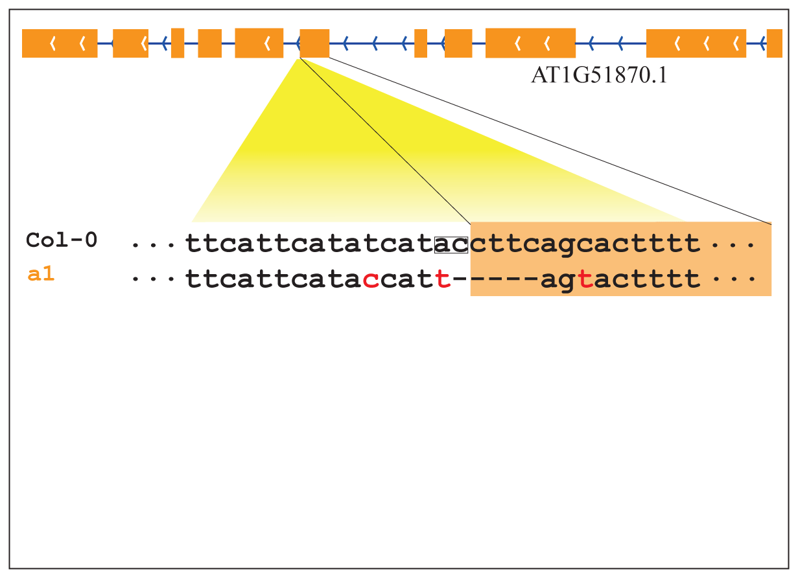

# GEAN &middot; [![license][license-badge]][license]

The gene sequence and genetic feature variation between different individuals are very important for natural variation research. And the genome sequence and genetic features (always in GFF/GTF format) of reference is well established. In general the genomic sequence of different lines/accession are sequenced.
The genetic features of variant individuals are also very interesting, while there no well established solution to transform the genetic features annotation of reference accession/line to other individuls. This pipeline tries transform the reference genetic fearures to variant individuls with genome sequence avaliable by whole-genome resequencing or *de novo* assembly . Here we provide a solution for [inconsistent alignment problem](https://journals.plos.org/plosgenetics/article?id=10.1371/journal.pgen.1007699) which could lead to false positive splice sites disturb or ORF-shift predication. And whole genome MSA is all developped basing on the genetic features.
GEAN could also use to transform the well annotated genetics feature of model species to phylogenetically nearby species with whole genome newly sequenced .

<p align="center">

</p>
Here GEAN solved this problem by a dynamic programming algorithm (Zebric stripped dynamic programming).
This pipeline could help to peform analysis where the gene structure annotaion of different accessions might important such the natural variation of certain single interesting gene, quantify the gene expression for non-reference accession/line and detect the difference expression level across different accession/line. 

Using the gene annotation as anchors, GEAN could perform base-pair resolution whole-genome-wide sequence alignment and perform variant calling.

## Install
### Dependencies
CPU support avx2\
GNU GCC >=6.0 \
Cmake >= 3.0
```
git clone https://github.com/baoxingsong/GEAN.git
cd GEAN
cmake CMakeLists.txt
make
```

this command will generate an executable file named gean
<!--
## Run it
````
Program gean
Usage: gean <command> [options]
Commands:
 -- variant calling:
    pseudogeno  create pseudo genome sequence
    lift        transform coordinate to another accession
    revlift     transform coordinate of another accession to reference
    liftgff     transform all the GFF/GTF coordinates
    revliftgff  transform all the GFF/GTF coordinates back to reference
    reanva      update variants records for functional annotation
    gff2seq     get the protein/CDS/gene sequence of GFF/GTF file
    annowgr     annotate re-sequenced genome
    randomVar   assign a random position for each variant
 -- whole genome wide MSA:
    premsa      cut the whole genome sequence into fragments
    msatosdi    generate sdi files from MSA results

 -- de novo assembly genome:
    transgff    trans reference gff/gtf to de novo assembly genome
    purifygff   purify the result from transgff
````

#### pseudogeno
Get pseudo-genome sequence of re-sequencing accession/line using reference genome sequence and variant calling records.
````
Usage: gean pseudogeno -r reference -v variants -o output
Options
 -h         produce help message
 -r FILE    reference genome in fasta format
 -v FILE    variant calling result in vcf/sdi format
 -p STRING  prefix for vcf records
 -o FILE    output pseudo genome in fasta format
````
** -prefix is the prefix of chromosome name for vcf/sdi variant records. Like the chromosome in TAIR10 reference genome is Chr1, Chr2, Chr3, Chr4 and Chr5. While the chromosomes in vcf files from the 1001 genomes project were indicated with 1, 2, 3, 4 and 5.
So `-prefix Chr` should be set to make the software work properly. If this parameter is not set correctly, the software would act as no variant records in the input vcf/sdi file.   

#### lift
Project/liftover a certain reference genome-sequence coordinate to re-sequencing accession/line pseudo-genome-sequence.
````
Usage: gean lift -v variants -c chromosome -p position
Options
 -h         produce help message
 -r FILE    reference genome in fasta format
 -v FILE    variant calling result in vcf/sdi format
 -f STRING  prefix for vcf records
 -c STRING  chromosome
 -p INT     the position/coordinate in reference genome
````

#### revlift
Project/liftover a certain coordinate of re-sequencing accession/line pseudo-genome-sequence to reference genome-sequence.
````
Usage: gean revlift -v variants -c chromosome -p position
Options
 -h         produce help message
 -r FILE    reference genome in fasta format
 -v FILE    variant calling result in vcf/sdi format
 -f STRING  prefix for vcf records
 -c STRING  chromosome, should be consistent with the chromosome information in sdi file (The coordinate starts from 1)
 -p INT     the position/coordinate in re-sequenced genome
````

#### liftgff
Inference the gene structure (gtf/gff file) annotation of re-sequencing accession/line by purely coordinate liftover.
````
Usage: gean liftgff -v variants -i inputGffFile -o outputGffFile
Options
 -h         produce help message
 -r FILE    reference genome in fasta format
 -v FILE    variant calling result in vcf/sdi format
 -i FILE    the input GFF/GTF file of reference line/accession
 -f STRING  prefix for vcf records
 -o         the output GFF/GTF file of target line/accession
````

#### revliftgff
Project/liftover the gene structure (gtf/gff file) annotation of re-sequencing accession/line to reference genome-sequence by purely coordinate liftover.
````
Usage: gean revliftgff -v variants -i inputGffFile -o outputGffFile
Options
 -h         produce help message
 -r FILE    reference genome in fasta format
 -v FILE    variant calling result in vcf/sdi format
 -i FILE    the input GFF/GTF file of non-reference line/accession
 -f STRING  prefix for vcf records
 -o         the output GFF/GTF file of reference line/accession
````

#### reanva
Realign the sequence using ZDP algorithm to solve the inconsistent INDEL alignment problem and recall all variants which could cause false positive ORF-state shit predication.
````
Usage: gean reanva -i inputGffFile -r inputGenome -a similar segments -s new genome sequence -o output GFF/GTF file
Options
 -h        produce help message
 -i FILE   GFF/GTF file
 -r FILE   reference genome sequence
 -v FILE   variant calling result in vcf/sdi format
 -f STRING prefix for vcf records
 -o FILE   output file
 -m INT    minimum intron size
 ````
 * By ORF-states, this software has following criteria:
     1) Splicing sites is one of motif in "SpliceSites", which is included in the release
     2) The minimum length of intron is larger than a certain value
     3) CDS sequence length is larger than a certain value
     4) The length of CDS sequence is divisible by 3
     5) No premature stop codon
     6) End with end codon
     7) Start with start codon
     The IUPAC Codes of DNA sequence could be well dealt with. 
     The result of ORF-states are included in the CDS sequence

#### gff2seq
Extract CDS sequence, C-DNA sequence and protein sequence for each protein-coding transcript. And predict the protein coding potential (termed as ORF-state)
````
Usage: gean gff2seq -i inputGffFile -r inputGenome -p outputProteinSequences -c outputCdsSequences -g outputGenomeSequences
Options
 -h        produce help message
 -i FILE   reference genome in GFF/GTF format
 -r FILE   genome sequence in fasta format
 -m INT    minimum intron size for ORF stats checking
 -p FILE   output file of protein sequence in fasta format
 -c FILE   output file of CDS (without intron) in fasta format
 -g FILE   output file of transcript (with intron) in fasta frormat
````

#### annowgr
Transform the reference gene structure annotation to re-sequencing accession/lines with several complementary methods.
````
Usage: gean annowgr -i inputGffFile -r referenceGenomeSequence -v variants -o outputGffFile
Options
 -h        produce help message
 -i FILE   reference GFF/GTF file
 -n FILE   the de novo annotation GFF of the target accession
 -r FILE   reference genome in fasta format
 -v FILE   variant calling result in vcf/sdi format
 -o FILE   the output GFF/GTF file
 -m INT    minimum intron size
 -d        remove reference ORF shift transcripts (default false)
 -f STRING prefix for vcf records
 -t INT    number of threads, default: 4
 -l INT  longest transcript to align. default(50000)
````


#### randomVar
Assign a random position for each variant in a variant calling result file, which could be used to compare the different between observed variant calling and random variants.
````
Usage: gean generateRandomSdi -v variants
Options
   -h        produce help message
   -r        (string) reference genome in fasta format
   -v        variant calling result in vcf/sdi format
   -o        prefix of output file
````


### Whole genome wide multiple sequence alignment pipeline (under testing)
#### premsa
cut the genome sequence of a population of individuals into fragments to perform multiple sequence alignment for each fragment.
````
Usage: gean premsa -i inputGffFile -r referenceGenomeSequence -v variants
Options
 -h         produce help message
 -i FILE    the input GFF/GTF file of reference line/accession
 -r FILE    reference genome
 -v FILE    list of variant calling results files
 -f STRING  prefix for vcf records
 -m INT     minimum intron size
 -t INT     number of threads, default: 4
 -w INT     window size, default: 10000
 -s INT     window overlap size, default: 500
 -p INT     output catch size (default 100)
 -l INT     longest transcript to align. default(50000)
````

#### msatosdi
perform variant calling from the multiple sequence alignment of sequence fragments of a population of genome sequences
````
Usage: gean msatosdi -i inputGffFile -r referenceGenomeSequence -v variants -o outputGffFile
Options
 -h         produce help message
 -a FILE    accession list
 -c FILE    chromosome list
 -m FOLDER  folder of MSA result
 -o FOLDER  output folder
 -r FILE    reference genome in fasta format
 -t INT     number of threads, default: 4
 -v FILE    list of variant calling results files
 -f STRING  prefix for vcf records
 ````
 
### pipeline to project the reference gene structure annotation to a de novo assembly genome sequence highly similar with the reference genome sequence
#### transgff
Project project reference gene structure annotation to a de novo genome sequence basing the whole genome sequence alignment.
The result file contains duplication gene annotations records, which might do not compile with other software and could be purified with the following function.
````
Usage: gean transgff -i inputGffFile -r inputGenome -a similar segments -s new genome sequence -o output GFF/GTF file
Options
 -h        produce help message
 -i FILE   reference GFF/GTF file
 -r FILE   reference genome sequence
 -a FILE   similar segments
 -s FILE   target genome sequence
 -o FILE   output GFF/GTF file
 -w INT    sequence alignment window width (default: 60)
 -l        run in slow model (default false)
 -m INT    minimum intron size
 ````
 
#### purifygff   
remove those duplication gene structure annotations generated from the transff function
````
 Usage: gean purifygff -i inputGffFile -s inputGenome -o output GFF/GTF file
 Options
  -h        produce help message
  -i FILE   GFF/GTF file
  -s FILE   target genome sequence
  -o FILE   output GFF/GTF file
  -x INT    minimum gene length
  -m INT    minimum intron size
````
-->
There are several functions are under testing and are included in the source code. The document for those functions will be released after testing.
Best Practices for different aims could be found under example.
### Manual
[gean_manual](gean-manual.pdf)
### examples
* [whole genome wide pair-wise sequence alignment and variants calling for de novo assembly](example/denovoVariantCalling/README.md)
* [genome wide multiple sequence alignment using variant calling result](example/variantsSynchronization/README.md)
* [transform maize reference genome annotation to de novo assembly](example/transformMaizeGFFannotation.md)
### Support us
Please support by citing us in your publication.
### Contact
Bug report? Any question? Any suggestion? Any requirement? Want to cooperate?\
Please feel free to send E-mail to songbaoxing168@163.com

### Citing GEAN
If you use GEAN, please cite: <br />
`
Song B, Sang Q, Wang H, Pei H, Gan X and Wang F. Complement Genome Annotation Lift Over Using a Weighted Sequence Alignment Strategy. Front. Genet. 10:1046. doi: 10.3389/fgene.2019.01046
`
### Acknowledgement
Thank [Prof. Usadel Björn](http://www.usadellab.org/) for great suggestions for speeding up\
Thank Dr. Hequan Sun from MPIPZ for discussions\
Thank Lukas Baumgarten from MPIPZ and Qiushi Li from University of UCalgary for bug reporting\
Thank Elad Oren from Hebrew University of Jerusalem for the extending usage of GEAN

### Founding
We acquired founding to continue the development of GEAN until 2022 Dec.

[license]: ./LICENSE.md
