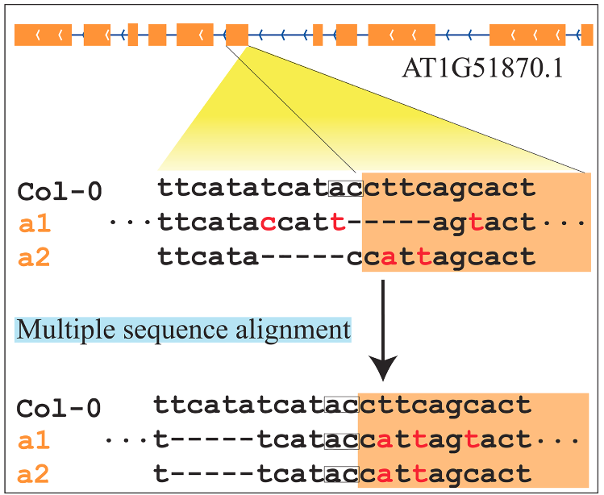

```{r, include=FALSE}
options(tinytex.verbose = TRUE)
```

```{r setup, include=FALSE}
knitr::opts_chunk$set(echo = TRUE)
knitr::opts_chunk$set(fig.pos = 'H')

def.chunk.hook  <- knitr::knit_hooks$get("chunk")
knitr::knit_hooks$set(chunk = function(x, options) {
  x <- def.chunk.hook(x, options)
  ifelse(options$size != "normalsize", paste0("\\", options$size,"\n\n", x, "\n\n \\normalsize"), x)
})

```

# GEAN
Here we provide a solution for INDEL inconsistent alignment problem which could lead to false positive splice sites disturb or ORF-shift predication. And a whole genome MSA pipeline has also been implemented basing on the genic features.

<div style="width:300px; height:200px; align:center; margin-bottom:80px">
<center>

</center>
</div>

By soving this problem, GEAN could be used to transform the well established genome annotation of model species to the genome of other natural variation individuls or phylogenetically nearby species with whole genome avaliable.

The inconsistent alignment problem could affect the function impact annotation of INDELs (non-coding INDEL V.S. ORF-shift INDEL), SNP (non-coding region SNP, coding region SNP), by re-alignment, those variants could be moved to non-coding regions.

## Install

### Dependencies
CPU support avx2
GNU GCC >=6.0 
Cmake >= 3.0
Due to the high computational density of weighted sequence alignment algorithm, GEAN only fully works on hadware platform supporting AVX2 CPU constructions.
As long as you are not using a very old machine, AVX2 should be valiable.

### Installation
```{bash eval = FALSE}
git clone https://github.com/baoxingsong/GEAN.git
cd GEAN
cmake CMakeLists.txt
make
```

## Usage

### Examples
Examples on different purpose and using genome with different complexity could be found on our [github: https://github.com/baoxingsong/GEAN/tree/master/example](https://github.com/baoxingsong/GEAN/tree/master/example)

```{r engine = 'bash', eval = TRUE, size="tiny"}
/home/bs674/software/bin/gean
```

### Working on variant calling result
Those functions are designed for whole-genome resequencing variant calling data. It works well for [sdi file](http://chi.mpipz.mpg.de/imrdenom/), which is a very simple file format.<br />
For VCF format, you should make sure there is no heterozygous variant calling result. If you are working heterozygous line, you could do phasing and separate your variant calling result into two or more VCF files. Please make sure you have only those variants records pass quality control in the input file.<br />
Since the VCF file format diverse from different variant calling software, we could not make our software work with all the VCF files, it is highly recommended to reform your vcf file into sdi format.<br />

Assume you have a vcf download from 1001 Arabidopsis thaliana website (http://1001genomes.org/data/GMI-MPI/releases/v3.1/intersection_snp_short_indel_vcf/intersection_10001.vcf.gz). After gzip, you could run this command to get sdi file.
<br />

```cat intersection_10001.vcf | grep -v "#" | awk '{print "Chr"$1"\t"$2"\t"length($5)-length($4)"\t"$4"\t"$5}'  > 10001.sdi```

<br />
<br />

#### Get pseudo genome sequence using reference genome sequence and variant calling result
Generate a pseudo genome by substitute the reference allele in reference genome sequence with alternative allele.
```{bash, size="tiny"}
/home/bs674/software/bin/gean pseudogeno
```

** -prefix is the prefix of chromosome name for vcf/sdi variant records. Like the chromosome in TAIR10 reference genome is Chr1, Chr2, Chr3, Chr4 and Chr5. While the chromosomes in vcf files from the 1001 genomes project were indicated with 1, 2, 3, 4 and 5.
So `-prefix Chr` should be set to make the software work properly. If this parameter is not configured correctly, the program will act as no variant records in the input vcf/sdi file.   

#### Liftover reference coordinate to pseudo-genome-sequence
Project/liftover a certain reference genome-sequence coordinate to re-sequencing accession/line with pseudo-genome-sequence avaliable aquired by the above command (pseudogeno). The lift over of the reference genomic coordinates to the pseudo-genome sequences of re-sequenced individuals is performed by counting the number of base pairs shifted by the upstream variants.
Use case: I am interested in the haplotype sequence of [RDO5 gene](http://www.plantphysiol.org/content/171/4/2659) in resequenced Arabidopsis population. I got the pseudo-genome-sequence for each individual, and liftover the start codon and stop codon coordinates of Col-0 RDO5 to all other individuals. And extract the haplotype sequence from each pseudo-genome-sequence, then I could perform a multiple sequence alignment.
```{bash, size="tiny"}
/home/bs674/software/bin/gean lift
```

#### Liftover pseudo-genome-sequence coordinate to reference genome sequence
Project/liftover a certain coordinate of re-sequencing accession/line pseudo-genome-sequence to reference genome-sequence.
```{bash, size="tiny"}
/home/bs674/software/bin/gean revlift
```

#### Liftover reference gff/gtf/gff3 annotation to pseudo-genome-sequence
Lift over the reference genome annotation (gtf/gff file) to a re-sequencing accession/line pseudo-genome-sequence by purely coordinate liftover.
```{bash, size="tiny"}
/home/bs674/software/bin/gean liftgff
```

#### Liftover pseudo-genome-sequence gff/gtf/gff3 annotation to reference genome sequence
Project/liftover the gene structure (gtf/gff file) annotation of re-sequencing accession/line to reference genome-sequence by purely coordinate liftover.
```{bash, size="tiny"}
/home/bs674/software/bin/gean revliftgff
```

#### Recall variants by align the genic region sequencing and keep the completeness of ORF
Realign the pseudo-genome sequence using ZDP algorithm to solve the inconsistent INDEL alignment problem and recall all variants to avoid false positive ORF-state shit predication.
This function assummes all the coordinates are 1-based. Except that point, it works well with bed files
```{bash, size="tiny"}
/home/bs674/software/bin/gean reanva
```
 * By ORF-states, this software has following criteria:
     1) Splicing sites is one of motif in "SpliceSites" file, which is included in the release
     2) The minimum length of intron is larger than a certain value
     3) CDS sequence length is larger than a certain value
     4) The length of CDS sequence is divisible by 3
     5) No premature stop codon
     6) End with end codon
     7) Start with start codon
     The IUPAC Codes of DNA sequence could be well dealt with. 
     The result of ORF-states are included in the CDS sequence

#### Extract sequece using genome sequence and annotation file
Extract CDS sequence, C-DNA sequence and protein sequence for each protein-coding transcript. And predict the protein coding potential (termed as ORF-state)
```{bash, size="tiny"}
/home/bs674/software/bin/gean gff2seq
```

#### Annotate the pseudo-genome-sequence
Transform the reference gene structure annotation to re-sequencing accession/lines with several complementary methods.
The approaches embed in this function are:
1) standard coordinate coordinate liftover.
2) ZDP approach.
3) exonerate CDS alignment
4) exonerate protein alignment
5) other genome annotation (you could obtain is using ab initio annotation [like Augustus](https://github.com/Gaius-Augustus/Augustus), or RNA-seq guided genome annotation )

For the first 4 approach, the gene structure predicated by the upstream module would be adapted firstly, and the region predicted as ORF-state shift would be handled by the below modules.
The genes mode in 5th module located in region that could not find a ORF-state conserved region in the first 4 modules will be ingegreted into the finall output.
```{bash, size="tiny"}
/home/bs674/software/bin/gean annowgr
```

#### Simulate random variants
Assign a random position for each variant in a variant calling result file, which was used to compare the different between observed variant calling and random variants.
```{bash, size="tiny"}
/home/bs674/software/bin/gean randomVar
```

### Whole genome wide multiple sequence alignment pipeline
The function implemented here is an updated version of the functions implemented in (Irisas)[https://github.com/baoxingsong/Irisas/].
The functions implemented are faster and consider genome annotations.
Fistly, cut the whole genome sequence into fragments.
Secnodly, Perform MSA on each fragments.
Finally, GEAN merge all the MSA alignment fragments into whole genome level, perform variant calling and output sdi files.
Please reference (Iriasa document) [https://github.com/baoxingsong/Irisas/tree/master/testData] for the whole pipeline.

#### Cut the (pseudo-)genome sequence of a population of individuals into fragments to perform multiple sequence alignment for each fragment.

```{bash, size="tiny"}
/home/bs674/software/bin/gean premsa
```

#### Variant calling using multiple sequence alignment
Perform variant calling from the multiple sequence alignment of sequence fragments of a population of genome sequences
```{bash, size="tiny"}
/home/bs674/software/bin/gean msatosdi
```

### Project reference annotation to de novo assemly genome sequence
Pipeline to project the reference gene structure annotation to a de novo assembly genome sequence highly similar with the reference genome sequence

#### Liftover reference genome annotation to a de novo assembly genome using whole genome alignment result
Liftover reference genome annotation to a de novo assembly genome sequence using whole genome sequence alignment.
This function perform standard sequence alignmetn to lift over genome annotation firstly, and then complement using ZDP approach.

The result file contains duplication gene annotations records, which might do not compile with other software and could be purified with the following function.
```{bash, size="tiny"}
/home/bs674/software/bin/gean transgff
```

#### Liftover reference genome annotation to a de novo assembly genome using CDS sequence mapping
This function implemented similar function as the above on, but it takes the minimap2 sam output as input.
Usage exmple is (valiable)[https://github.com/baoxingsong/GEAN/blob/master/example/transformMaizeGFFannotation.md].
```{bash, size="tiny"}
/home/bs674/software/bin/gean spltogff
```


#### Liftover reference genome annotation to a de novo assembly genome using CDS sequence mapping
This function implemented similar function as the above on, but it takes the minimap2 sam output as input.
Usage exmple is (valiable)[https://github.com/baoxingsong/GEAN/blob/master/example/transformMaizeGFFannotation.md].
```{bash, size="tiny"}
/home/bs674/software/bin/gean spltogff
```

#### Remove duplication genome annotation records   
Remove those duplication gene structure annotations generated from the transff function
```{bash, size="tiny"}
/home/bs674/software/bin/gean purifygff
```


#### Syntenic protein coding gene analysis for the whole chromosome
This function perform syntenic analysis for the whole chromosome for the whole genome using the longest path approach. It tried to align all the genes on the whole chromosome and good for the analysis that assume no large genome re-arrangement happened.
And it ware used for the syntenic Arabidopsis col-0 and ler-0.
```{bash, size="tiny"}
/home/bs674/software/bin/gean sinsyn
```

#### Syntenic protein coding gene analysis for local regions
Perform syntenic analysis for the local regions. It assumes large scale genome re-arrangements. And the output syntenic are more fragmented.
This fucntion was used to the syntenic analysis of Arabidopsis and Cardamine hirsuta.
```{bash, size="tiny"}
/home/bs674/software/bin/gean sinsyn
```

#### Syntenic protein coding gene for genomes with different whole genome duplication history
This function could be used for two genome with different whole genome duplication and parameters could be tuned for homologous genes have different copies.
Perform syntenic analysis using local regions. It assumes large scale genome re-arrangements.

```{bash, size="tiny"}
/home/bs674/software/bin/gean quotasyn
```

#### Keep only ORF conserved genes from GFF file
Remove all the ORF shifted genomoe annotation records from the input gff file
```{bash, size="tiny"}
/home/bs674/software/bin/gean orf
```

#### Base pair level variant callnig for de novo genome sequence
Perform base-pair level variant for de novo genome sequence and out put a sdi file. The de novo genome should be in fasta file, and in chromosome level.
And the homologous chromosome should share the same entry ID with the reference genome fasta file. It assumes there is no re-arrangement.
By base-pair level variant calling, we mean given the reference genome and the variant calling result, GEAN could infer the query genome sequence without any error.
```{bash, size="tiny"}
/home/bs674/software/bin/gean varcall
```


### Acknowledgements
The GEAN development team would like to thank all our enthusiastic users who have contacted us with
suggestions to improve the codebase, request new functions, point out bugs, and beta-test the initial
versions of GEAN. Many thanks also to everyone who has used GEAN and
cited the publication – we are glad it has proven useful in your research, and a good citation
record will help us to obtain fundings to keep developing GEAN.

### Citation
If you use GEAN, please cite: <br />
`
Baoxing Song, Qing Sang, Hai Wang, Huimin Pei, Fen Wang and Xiangchao Gan. (2019) A weighted sequence alignment strategy for gene structure annotation lift over from reference genome to a newly sequenced individual. bioRxiv. doi:10.1101/615476
`
